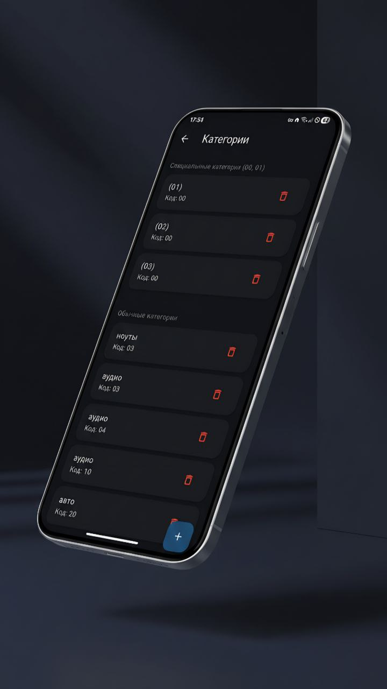
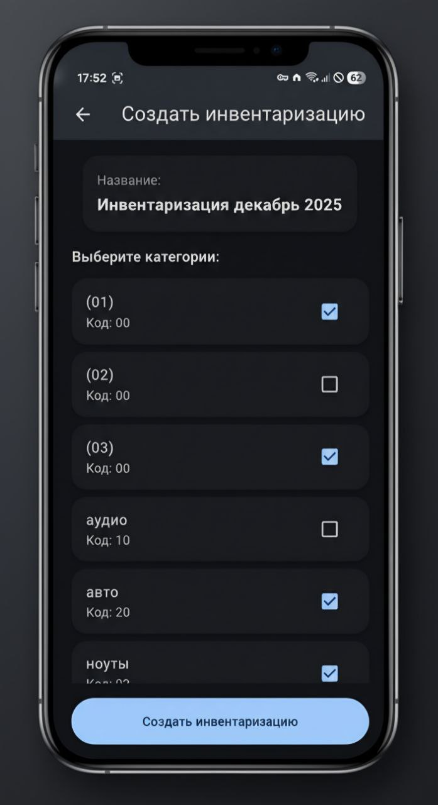
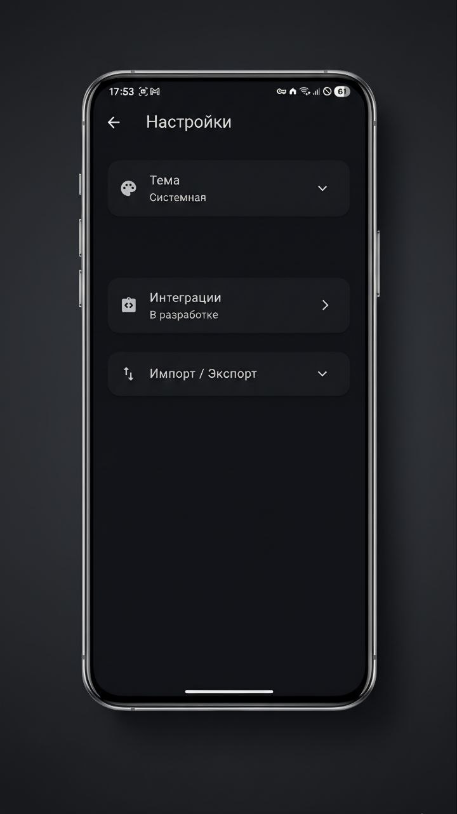

<div align="center">
  
  
  # Учет инвентаризации
  
  Flutter приложение для управления инвентаризациями с категориями.
</div>

## Функциональность



### Главный экран
- Список всех инвентаризаций (от старых к новым)
- Отображение названия, даты создания, прогресс-бара
- Цветовая индикация прогресса:
  - 🔴 Красный: менее 50%
  - 🟡 Желтый: 50% и более
  - 🟢 Зеленый: 100% (завершено)
- Кнопка "+" для создания новой инвентаризации
- Кнопка "Категории" в AppBar



### Категории
- Создание категорий с одним полем ввода (например: "20 - автотовары")
- Автоматическое извлечение кода из названия
- Группировка категорий с кодами "00" и "01" в специальную группу
- Удаление категорий


### Создание инвентаризации
- Автоматическое название на основе месяца (например: "Инвентаризация январь 2026")
- Выбор категорий из списка
- Обязательный выбор хотя бы одной категории



### Детали инвентаризации
- Просмотр всех категорий инвентаризации
- Отметка категории как завершенной:
  - Нажатие на категорию
  - Свайп влево
- Удаление категории:
  - Свайп вправо
  - Восстановление через уведомление (3 секунды)
- Снятие отметки: удержание на завершенной категории
- Автоматическое обновление прогресс-бара
- Дата завершения отображается когда все категории завершены

## Установка и запуск

1. Убедитесь, что у вас установлен Flutter SDK
2. Установите зависимости:
```bash
flutter pub get
```

3. Запустите приложение:
```bash
flutter run
```

## Технологии

- Flutter 3.0+
- SharedPreferences для локального хранения данных
- Material Design 3
- Intl для форматирования дат

## Структура проекта

```
lib/
├── main.dart                 # Точка входа
├── models/                   # Модели данных
│   ├── inventory.dart
│   ├── category.dart
│   └── category_status.dart
├── screens/                  # Экраны приложения
│   ├── home_screen.dart
│   ├── categories_screen.dart
│   ├── create_inventory_screen.dart
│   └── inventory_detail_screen.dart
└── services/                 # Сервисы
    └── storage_service.dart
```

